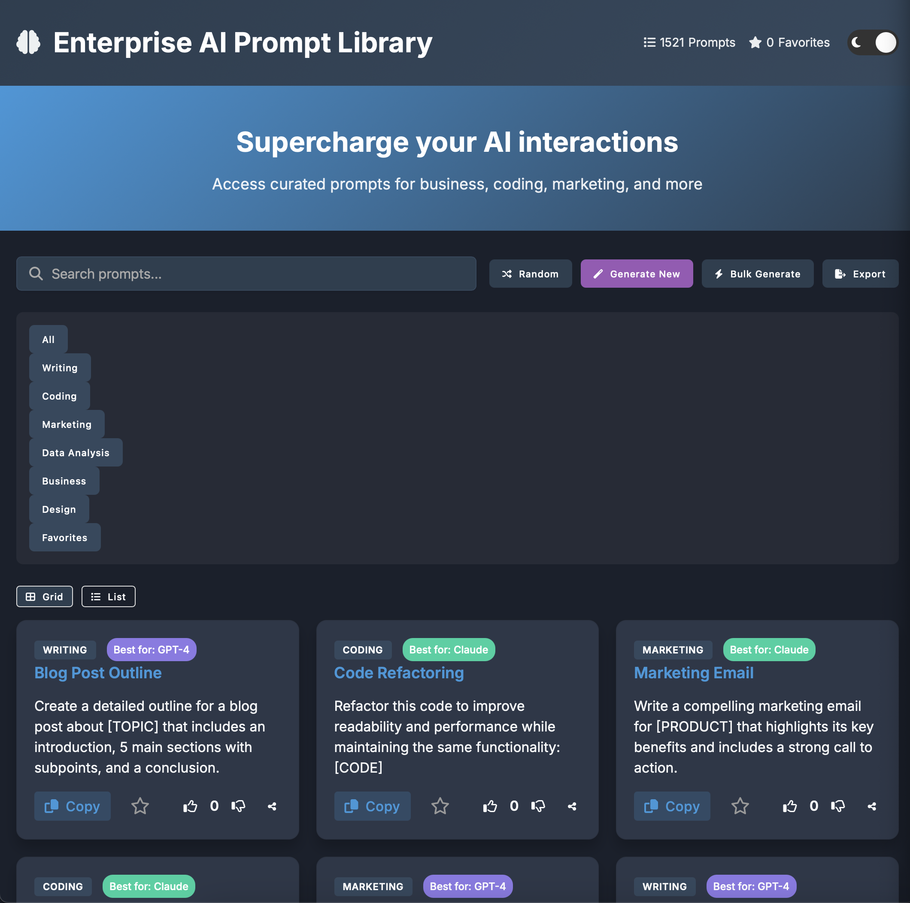

# Enterprise AI Prompt Library



A curated collection of AI prompts designed to help professionals get the most out of AI tools like GPT-4, Claude, Gemini, Llama, and Midjourney.

## 🚀 Features

- **Extensive Prompt Collection**: Access 100+ professionally crafted prompts across multiple categories
- **Category Filtering**: Browse prompts by category (Writing, Coding, Business, Marketing, etc.)
- **AI-Specific Recommendations**: Each prompt is tagged with the AI model it works best with
- **Favorites System**: Save your most-used prompts for quick access
- **Search Functionality**: Find specific prompts by keyword
- **Variable Templates**: Customize prompts with your specific information using template variables
- **Dark/Light Mode**: Choose your preferred visual theme
- **Responsive Design**: Works on desktop, tablet, and mobile devices
- **Export Options**: Export your prompts collection in JSON or CSV format
- **Offline Support**: Works offline with PWA capabilities

## 📋 Usage

1. **Browse Prompts**: Navigate through categories or use the search function to find prompts
2. **View Details**: Click on any prompt card to see the full prompt and details
3. **Copy to Clipboard**: Use the copy button to copy the prompt to your clipboard
4. **Customize Variables**: Replace text in [BRACKETS] with your specific information
5. **Save Favorites**: Click the star icon on any prompt to save it to your favorites
6. **Switch Views**: Toggle between grid and list views for different browsing experiences
7. **Export Collection**: Export your prompts for backup or sharing

## 🔧 Installation

### Option 1: Use the hosted version
Visit [https://your-github-username.github.io/enterprise-ai-prompt-library](https://your-github-username.github.io/enterprise-ai-prompt-library)

### Option 2: Run locally
1. Clone the repository:
   ```
   git clone https://github.com/your-github-username/enterprise-ai-prompt-library.git
   ```
2. Navigate to the project directory:
   ```
   cd enterprise-ai-prompt-library
   ```
3. Open `index.html` in your browser or use a local server:
   ```
   python -m http.server
   ```
   Then visit `http://localhost:8000` in your browser.

## 🚀 Deploying to GitHub Pages

This project is configured to work with GitHub Pages out of the box. To deploy:

1. Push your code to GitHub
2. Go to your repository settings
3. Scroll down to the "GitHub Pages" section
4. Select the branch you want to deploy (usually `main` or `master`)
5. Select the root folder as the source
6. Click Save

Your site will be published at `https://your-github-username.github.io/enterprise-ai-prompt-library`

## 🤝 Contributing

Contributions are welcome! If you'd like to add new prompts or improve existing ones:

1. Fork the repository
2. Create a new branch (`git checkout -b feature/amazing-prompts`)
3. Add your prompts to the `js/prompts.js` file following the existing format
4. Commit your changes (`git commit -m 'Add some amazing prompts'`)
5. Push to the branch (`git push origin feature/amazing-prompts`)
6. Open a Pull Request

## 📝 License

This project is licensed under the MIT License - see the [LICENSE](LICENSE) file for details.

## 🙏 Acknowledgements

- Font Awesome for icons
- Google Fonts for typography
- All contributors who have helped improve this library

## 📬 Contact

If you have any questions or suggestions, please open an issue on GitHub.

---

Made with ❤️ for the AI community
